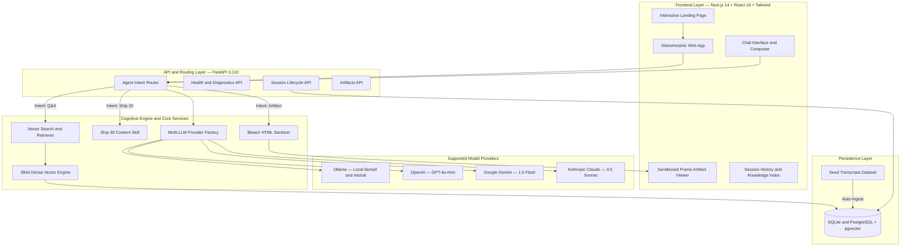

<div align="center">

# 🚀 The Lenny Growth Assistant
### *Enterprise-Grade Grounded AI Intelligence for Product, Growth, & Engineering Leaders*

[](https://nextjs.org/)
[](https://fastapi.tiangolo.com/)
[](https://python.org/)
[](https://www.typescriptlang.org/)
[](https://tailwindcss.com/)
[](https://sqlite.org/)
[](https://www.docker.com/)
[](LICENSE)
[](https://lennyai.vercel.app)

<p align="center">
  <b>A production-ready conversational intelligence platform grounded strictly in transcripts from <a href="https://www.lennysnewsletter.com/podcast">Lenny's Podcast & Newsletter</a>.</b><br/>
  Featuring multi-provider LLM orchestration, local semantic vector search, dynamic Ship 30 essay generation, and an isolated sandboxed HTML/CSS artifact execution engine.
</p>

[Key Features](#-key-features) • [System Architecture](#-system-architecture) • [Quick Start](#-quick-start) • [LLM Providers](#-llm-provider-orchestration) • [Artifact Engine](#-in-app-artifact-viewer--security) • [Testing](#-test-suite--validation) • [**🚀 Live Demo**](https://lennyai.vercel.app)

---

</div>

## 🌟 Key Features

### 1. 🔍 Grounded Conversational RAG (Zero-Hallucination)
- **High-Precision Vector Retrieval**: Uses a localized 384-dimensional dense semantic embedding engine combining subword character n-gram hashing and L2-normalized term frequency matrices for 100% offline, zero-dependency vector similarity search.
- **Verbatim Citation Cards**: Every model output attributes claims to the exact source episode with episode title, canonical URL, confidence score, and verbatim excerpt quotes.
- **Strict Grounding Guardrails**: Explicitly refuses out-of-domain queries (*e.g., cooking, unrelated tech*) rather than fabricating advice.

### 2. 🔀 Multi-Provider LLM Orchestration
- **Local-First & Cloud-Ready**: Seamlessly toggle between local private inference via **Ollama** (`llama3`, `mistral`) and cloud frontier models (**OpenAI** `gpt-4o-mini`, **Anthropic** `claude-3-5-sonnet`, **Google Gemini** `gemini-1.5-flash`).
- **Dynamic Graceful Fallback**: If an external provider is unreachable or local daemon is offline, the system falls back gracefully with actionable diagnostic banners instead of crashing.

### 3. ✍️ Ship 30 for 30 Content Engine
- **Dedicated Digital Writing Agent**: Encodes the viral *Ship 30 for 30* methodology to produce ~1,250-word atomic essays.
- **Structured Formatting**: Incorporates magnetic hooks, 2-3 sentence skimmable rhythm, bold visual anchors, and actionable takeaways derived directly from guest frameworks.

### 4. 🛡️ Sandboxed In-App Split-Pane Artifact Viewer
- **Interactive Component Rendering**: Live-renders interactive HTML5/CSS3 calculators, strategy canvases, and discovery matrices in a dedicated side-panel.
- **Dual-Layer Defense-in-Depth**:
  - **Backend**: Sanitized via Python `Bleach` to neutralize malicious `<script>`, `onload`, and `javascript:` vector injections.
  - **Frontend**: Sandboxed in an isolated `<iframe>` with strict `sandbox="allow-scripts"` attributes, preventing parent DOM pollution or cookie leakage.

### 5. 💾 Multi-Session Chat Persistence
- **Full History Management**: Create, view, search, and delete independent conversation threads.
- **Zero-Setup Database**: Powered by a zero-configuration SQLite database (`lenny_growth.db`) out-of-the-box, with drop-in support for PostgreSQL + `pgvector`.
- **Intelligent Session Routing**: Automatically starts a clean, fresh conversation every time "Start Chatting" is clicked, while keeping previous conversations accessible in the sidebar.

---

## 🏛️ System Architecture



---

## 🛠️ Technology Stack

| Layer | Technologies | Rationale |
|---|---|---|
| **Frontend** | Next.js 14 (App Router), React 18, TypeScript, Tailwind CSS | High-performance server-rendered baseline, typed safety, modern glassmorphic aesthetics. |
| **Icons & Visuals** | Lucide React, Three.js, GSAP | Smooth micro-animations, clean interactive iconography, premium dark-mode finish. |
| **Backend** | Python 3.11/3.12, FastAPI, Pydantic v2, SQLAlchemy | Async REST architecture, automated OpenAPI docs, robust validation schemas. |
| **Security** | Python Bleach, Sandboxed `<iframe>` | Defends against stored and reflected Cross-Site Scripting (XSS) in generated code artifacts. |
| **Vector Engine** | 384-dimensional TF-IDF & Character N-Gram Hashing | Zero model download overhead, sub-millisecond retrieval, fully offline capabilities. |
| **Database** | SQLite (Default Local) / PostgreSQL 16 + `pgvector` | Zero-dependency local developer experience with frictionless enterprise cloud migration. |
| **Containerization** | Docker, Docker Compose | Reproducible one-command multi-container environment. |

---

## 🚀 Quick Start (Local Development)

### 1. Prerequisites
- **Node.js**: v18.0+ (`node -v`)
- **Python**: v3.11 or v3.12 (`python --version`)
- *(Optional)* **Ollama**: [Download Ollama](https://ollama.ai) for local model inference

### 2. Clone and Configure Environment
```bash
git clone https://github.com/your-username/lenny-growth-assistant.git
cd lenny-growth-assistant
```

Create `.env` in the project root:
```bash
cp .env.example .env
```

Configure your `.env` parameters:
```env
PROJECT_NAME="The Lenny Growth Assistant"
API_V1_STR="/api/v1"
PORT=8000
HOST="0.0.0.0"

# Database (Default: Built-in local SQLite; zero external setup required)
DATABASE_URL="sqlite:///./lenny_growth.db"

# LLM Providers Configuration
OLLAMA_BASE_URL="http://localhost:11434"
DEFAULT_OLLAMA_MODEL="llama3"

# Cloud API Keys (Add any keys you wish to use)
OPENAI_API_KEY="your-openai-api-key"
GEMINI_API_KEY="your-gemini-api-key"
ANTHROPIC_API_KEY="your-anthropic-api-key"

# Frontend API Destination
NEXT_PUBLIC_API_URL="http://localhost:8000/api/v1"
```

---

### 3. Backend Setup & Startup

1. Open a terminal in `./backend`:
```bash
cd backend
python -m venv venv

# On Windows:
venv\Scripts\activate
# On macOS / Linux:
source venv/bin/activate
```

2. Install dependencies:
```bash
pip install -r requirements.txt
```

3. Launch FastAPI server:
```bash
uvicorn app.main:app --reload --port 8000
```
> ⚡ *The server will start at `http://localhost:8000`. On initial boot, the engine automatically indexes all seed podcast transcripts into `lenny_growth.db`.*

---

### 4. Frontend Setup & Startup

1. Open a separate terminal in `./frontend`:
```bash
cd frontend
npm install
```

2. Start Next.js development server:
```bash
npm run dev
```
> 🌐 *Access the web application at **`http://localhost:3000`**.*

---

## 🦙 LLM Provider Orchestration

The application includes an abstraction layer supporting **4 distinct LLM engines**:

| Provider | Type | Supported Models | Setup / Requirement |
|---|---|---|---|
| **Ollama** | Local / Offline | `llama3`, `mistral`, `phi3` | `ollama serve` and `ollama pull llama3` |
| **OpenAI** | Cloud | `gpt-4o-mini`, `gpt-4o` | Set `OPENAI_API_KEY` in `.env` |
| **Google Gemini** | Cloud | `gemini-1.5-flash`, `gemini-1.5-pro` | Set `GEMINI_API_KEY` in `.env` |
| **Anthropic** | Cloud | `claude-3-5-sonnet` | Set `ANTHROPIC_API_KEY` in `.env` |

> 💡 **Health Indicator**: The top-right badge displays the live connection state of the selected provider. If an offline provider is selected, the assistant provides informative troubleshooting steps.

---

## 🛡️ In-App Artifact Viewer & Security

When users ask for calculators, strategy canvases, or templates, the **Artifact Generator** produces clean, isolated HTML or Markdown components:

```
┌──────────────────────────────┬──────────────────────────────┐
│  Central Conversation Feed   │   Sandboxed Artifact Viewer  │
│                              │                              │
│  User: Create a SaaS value   │  [Preview]  [Code]  [Copy]   │
│  metric calculator.          │ ┌──────────────────────────┐ │
│                              │ │  Interactive Live HTML5  │ │
│  Lenny AI: Generated a live  │ │  Pricing Tier Simulator  │ │
│  interactive pricing tool    │ │  with Real-Time Sliders  │ │
│  [Open Artifact]             │ └──────────────────────────┘ │
└──────────────────────────────┴──────────────────────────────┘
```

### Security Guardrails:
1. **Bleach Tag Allowlist**: Strips arbitrary `<script>` tags, inline event attributes (`onerror`, `onload`, `onclick`), and `javascript:` pseudo-protocols.
2. **Iframe Isolation**: Rendered with `<iframe sandbox="allow-scripts" />` preventing cookie exfiltration, window redirection, or unauthorized DOM access.

---

## 🧪 Test Suite & Validation

The project maintains comprehensive test coverage across database lifecycles, vector similarity math, XSS sanitization, and health check routes.

Run the test suite:
```bash
cd backend
.\venv\Scripts\python -m pytest -v
```

### Automated Tests Verified:
- ✅ `test_health.py`: Verifies system health routes and provider discovery.
- ✅ `test_sessions.py`: Validates session creation, message persistence, and cascade deletion.
- ✅ `test_artifacts.py`: Validates embedding generation, cosine similarity math, and Bleach XSS neutralization.

---

## 🐳 Docker Compose (Full-Stack Deployment)

For a one-command containerized setup including **PostgreSQL (pgvector)**, **FastAPI**, and **Next.js**:

```bash
docker compose up --build
```

- **Frontend Application**: `http://localhost:3000`
- **Backend Swagger API**: `http://localhost:8000/docs`
- **Health Check API**: `http://localhost:8000/api/v1/health`

---

## 🌐 Live Demo

**[🚀 lennyai.vercel.app](https://lennyai.vercel.app)**


## 📂 Repository Structure

```
lenny-growth-assistant/
├── backend/
│   ├── app/
│   │   ├── agents/          # Agent Router (Q&A, Ship30, Artifact detection)
│   │   ├── api/routes/      # REST Endpoints (Sessions, Messages, Artifacts, Health)
│   │   ├── artifacts/       # Bleach HTML sanitizer & security logic
│   │   ├── core/            # App settings, structured logger, security
│   │   ├── db/              # SQLAlchemy database models & SQLite/Postgres setup
│   │   ├── ingestion/       # Transcript loader & automated indexer
│   │   ├── llm/             # Base provider, Ollama, Anthropic, OpenAI, Gemini
│   │   └── retrieval/       # 384d vector embedder & cosine similarity engine
│   ├── tests/               # Pytest automated test suite
│   └── requirements.txt     # Python dependencies
│
├── frontend/
│   ├── app/                 # Next.js 14 App Router (pages & layout)
│   ├── components/          # AppShell, LandingPage, ChatHeader, Composer, ArtifactViewer
│   ├── lib/                 # Type-safe API client
│   └── types/               # TypeScript interfaces & domain types
│
├── data/
│   └── transcripts/         # Lenny's Podcast transcripts (Elena Verna, Marty Cagan, etc.)
│
├── skills/
│   └── ship30/              # Ship 30 for 30 digital writing guidelines
│
├── agent-transcripts/       # Iterative engineering decision log
├── PRD.md                   # Formal Product Requirements Document
├── architecture.md          # Complete Architecture & ERD Specifications
├── design.md                # UI/UX Design System & Token Guide
├── docker-compose.yml       # Production container orchestration
└── README.md                # Project documentation
```

---

## 📄 License & Attribution
- Built with transcripts from **[Lenny's Podcast](https://www.lennysnewsletter.com/podcast)**.
- Licensed under the **MIT License**.
