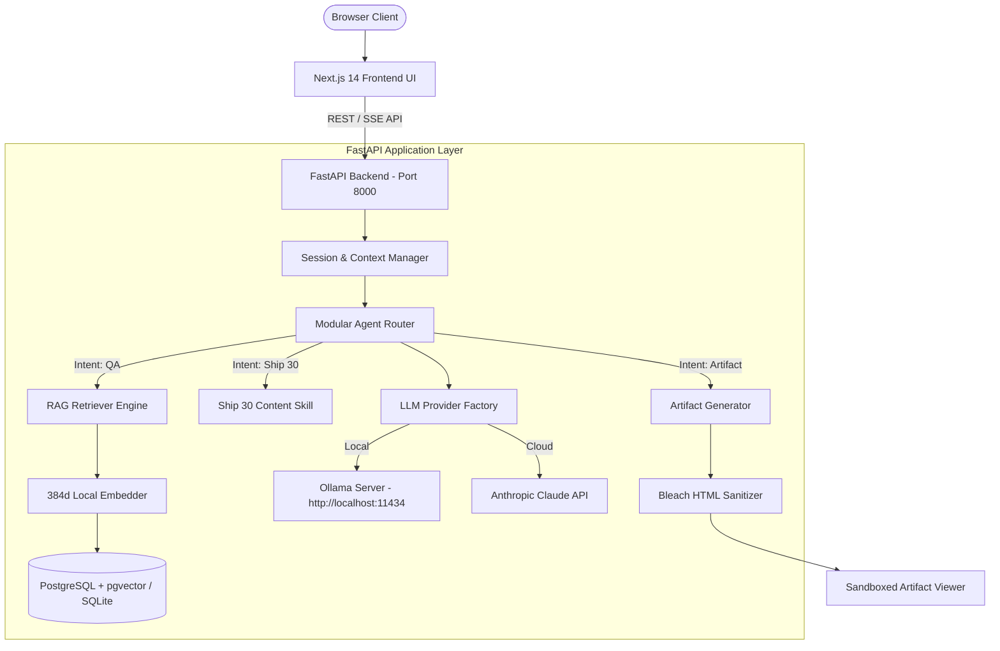
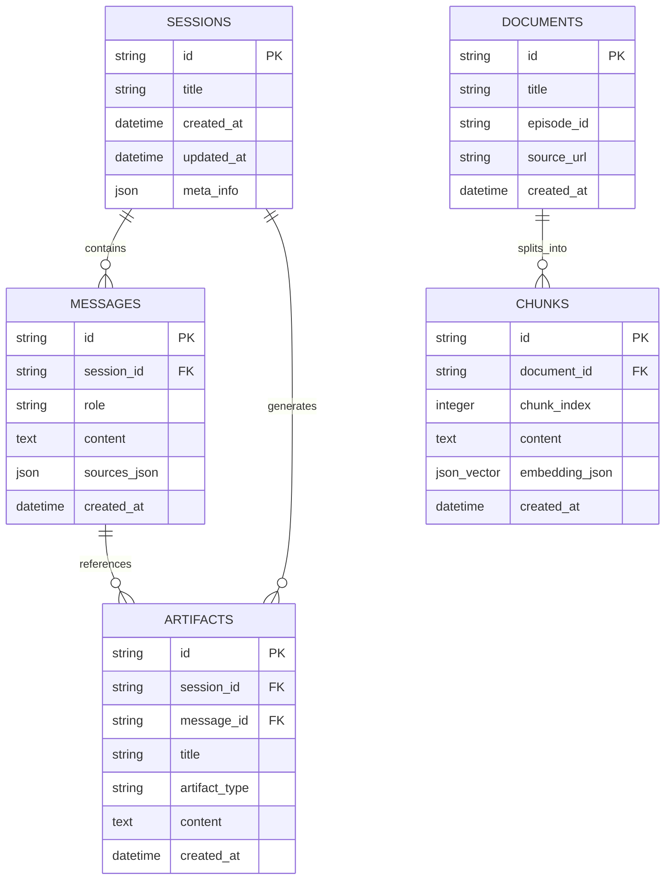

# Architecture Specification (`architecture.md`) — The Lenny Growth Assistant

---

## 1. System Topology & Architecture Overview

---

## 2. Database Schema (PostgreSQL + pgvector)

### Logical Tables & Entity Relationships

---

## 3. API Contract Specifications

### Health Check
- `GET /api/v1/health`
- **Response**: `{ "status": "ok", "database": "healthy", "ollama": { "available": true }, "anthropic": { "available": true } }`

### Sessions API
- `POST /api/v1/sessions` — Create session.
- `GET /api/v1/sessions` — List sessions.
- `GET /api/v1/sessions/{id}` — Get session.
- `GET /api/v1/sessions/{id}/messages` — Get session messages.

### Conversational Chat API
- `POST /api/v1/chat`
- **Request**: `{ "session_id": "...", "message": "What is PLG?", "provider": "ollama"|"anthropic" }`
- **Response**: `{ "session_id": "...", "content": "...", "sources": [...], "provider": "ollama", "artifact_id": "..." }`

### Artifacts API
- `GET /api/v1/artifacts/{id}` — Get single artifact.
- `GET /api/v1/artifacts/session/{session_id}` — List artifacts in session.

---

## 4. Security Architecture

1. **HTML Security & DOM Sanitization**:
   - Backend HTML sanitizer using `Bleach` strips `<script>`, inline event handlers (`onload`, `onclick`), `javascript:` URIs, and dangerous elements.
   - Frontend renders HTML inside an isolated `<iframe>` with `sandbox="allow-scripts"` to prevent parent DOM manipulation or cookie theft.
2. **Environment Secret Protection**:
   - All credentials loaded via `pydantic-settings` from `.env`.
   - `.env` excluded in `.gitignore`. `.env.example` provided with safe placeholder defaults.
3. **CORS Security**:
   - Configured with explicitly permitted origins for Next.js frontend.
