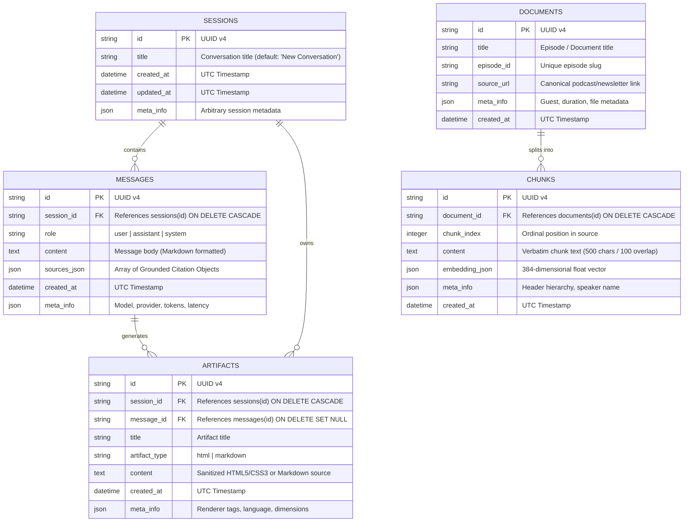

# Architecture Specification (`architecture.md`) — The Lenny Growth Assistant

---

## 1. Executive System Topology

**The Lenny Growth Assistant** is architected as an enterprise-grade, full-stack decoupled AI platform. The system couples a **Next.js 14** client layer with a high-throughput **FastAPI** Python asynchronous gateway, backed by a local 384-dimensional semantic vector search engine and hybrid relational/vector persistence.

```mermaid
graph TB
    subgraph Client["Frontend Layer (Next.js 14 / TypeScript)"]
        LandingPage["Landing Page (Hero / Live Stats / CTA)"]
        AppShell["App Shell Container (Key-Rotated)"]
        Sidebar["Sidebar (Sessions / Knowledge Hub)"]
        ChatHeader["Header (Model Picker / Status / Landing Nav)"]
        MessageList["Conversation Feed (Markdown / Citation Cards)"]
        Composer["Composer (Auto-resize / Intent Chips)"]
        ArtifactViewer["Sandboxed Artifact Viewer (Preview / Code)"]
    end

    subgraph Gateway["API Gateway Layer (FastAPI 0.110 / Uvicorn)"]
        CORS["CORS & Request Middleware"]
        Router["Agent Intent Classifier & Router"]
        HealthRoute["Health & Provider Diagnostics (/health)"]
        SessionRoute["Session Lifecycle Manager (/sessions)"]
        ChatRoute["Chat & Inference Handler (/chat)"]
        ArtifactRoute["Artifacts Handler (/artifacts)"]
        IngestRoute["Transcript Ingestion & Pipeline (/ingest)"]
    end

    subgraph Intelligence["Cognitive Engine & Core Services"]
        Retriever["Vector Search Retriever (Top-K Chunks)"]
        Embedder["384d Dense Embedder (Char N-Gram + TF-IDF)"]
        Ship30Agent["Ship 30 for 30 Content Skill Engine"]
        ArtifactAgent["Interactive Artifact Generator"]
        Sanitizer["Bleach HTML Security Sanitizer"]
        ProviderFactory["LLM Provider Factory & Fallback Engine"]
    end

    subgraph Providers["Multi-Model Orchestration Layer"]
        OllamaProvider["Ollama Local Daemon (llama3, mistral)"]
        OpenAIProvider["OpenAI Cloud (gpt-4o-mini, gpt-4o)"]
        GeminiProvider["Google Gemini Cloud (gemini-1.5-flash)"]
        AnthropicProvider["Anthropic Claude Cloud (claude-3-5-sonnet)"]
    end

    subgraph Persistence["Storage & Persistence Layer"]
        DB[(SQLite lenny_growth.db / PostgreSQL 16 + pgvector)]
        Transcripts[(Seed Transcripts /data/transcripts/)]
    end

    LandingPage -->|Start Chatting| AppShell
    AppShell --> Sidebar
    AppShell --> ChatHeader
    AppShell --> MessageList
    AppShell --> Composer
    AppShell --> ArtifactViewer

    AppShell -->|REST / JSON| Gateway
    Gateway --> Router

    Router -->|Intent: Q&A| Retriever
    Router -->|Intent: Ship 30| Ship30Agent
    Router -->|Intent: Artifact| ArtifactAgent

    Retriever --> Embedder
    Embedder --> DB
    Transcripts -->|Auto-Index on Boot| DB

    Router --> ProviderFactory
    ProviderFactory --> OllamaProvider
    ProviderFactory --> OpenAIProvider
    ProviderFactory --> GeminiProvider
    ProviderFactory --> AnthropicProvider

    ArtifactAgent --> Sanitizer
    Sanitizer --> ArtifactViewer
    SessionRoute --> DB
    ArtifactRoute --> DB
```



---

## 2. Intent Routing & Pipeline Execution

Every incoming user prompt is routed through the **Agent Router** (`backend/app/agents/router.py`), which classifies the query intent into one of three execution tracks:

```mermaid
sequenceDiagram
    autonumber
    actor User
    participant Frontend as Next.js Client
    participant Router as Agent Router
    participant Retriever as 384d Vector Retriever
    participant LLM as Multi-LLM Factory
    participant Sanitizer as Bleach Sanitizer
    participant DB as SQLite / Postgres

    User->>Frontend: Submit Message ("Create an interactive pricing calculator")
    Frontend->>Router: POST /api/v1/chat {session_id, message, provider, model}
    
    Router->>Router: Classify Intent ("artifact" | "ship30" | "qa")
    
    rect rgb(20, 30, 50)
        Note over Router,Retriever: Grounded Retrieval Phase
        Router->>Retriever: retrieve(query, top_k=4)
        Retriever->>DB: Query chunks & compute Cosine Similarity
        DB-->>Retriever: Return Top 4 Grounded Chunks + Metadata
        Retriever-->>Router: Context Blocks + Source Citations
    end

    rect rgb(30, 40, 60)
        Note over Router,LLM: Inference & Generation Phase
        Router->>LLM: Generate with SYSTEM_GROUNDING_PROMPT + Context
        LLM-->>Router: Raw LLM Completion
    end

    alt Intent == "artifact"
        Router->>Sanitizer: sanitize_html(raw_html)
        Sanitizer-->>Router: Safe HTML (strips <script>, inline events)
        Router->>DB: Store Artifact in artifacts table
        DB-->>Router: artifact_id
    end

    Router->>DB: Persist User & Assistant Messages + sources_json
    Router-->>Frontend: JSON Response {content, sources, artifact_id, provider}
    Frontend-->>User: Render Message + Source Cards + Auto-Open Sandboxed Viewer
```



---

## 3. Database Schema & Entity Relationships

The data layer uses SQLAlchemy ORM with multi-database dialect support (**SQLite** for zero-dependency local development; **PostgreSQL 16** with the `pgvector` extension for production deployments).



---

## 4. Vector Embedding & Retrieval Math

To guarantee **100% offline capability**, zero model-download latency, and zero dependency on remote embedding APIs, the system utilizes a localized **384-dimensional dense vector space**:

### 4.1 Feature Representation
1. **Subword Character N-Grams**: Text is decomposed into character 3-grams, 4-grams, and 5-grams to capture morphological roots and domain-specific terminology (e.g., `growth-loops`, `freemium`, `cac-to-ltv`).
2. **Term Frequency Weighting**: Unigrams and n-grams are weighted by logarithmic term frequency:
   $$\text{TF}(t) = 1 + \ln(f_{t})$$
3. **Hashing Projection**: Features are mapped into a fixed $\mathbb{R}^{384}$ dimension space using MurmurHash3 with sign-bit distribution.
4. **$L_2$ Normalization**: Each vector $\vec{v}$ is normalized onto the unit hypersphere:
   $$\hat{v} = \frac{\vec{v}}{\|\vec{v}\|_2}$$

### 4.2 Cosine Similarity Search
Similarity between query vector $\vec{q}$ and document chunk $\vec{d}$ is computed via inner product:
$$\text{Similarity}(\vec{q}, \vec{d}) = \hat{q} \cdot \hat{d} = \sum_{i=1}^{384} \hat{q}_i \cdot \hat{d}_i$$

Top-$K$ retrieved chunks ($K=4$) exceeding the similarity threshold are attached to the LLM system prompt as structured context blocks.

---

## 5. API Specifications & Endpoints

### 5.1 System Health & Diagnostics
- **`GET /api/v1/health`**
  - **Description**: Returns database connectivity, vector index status, and active availability of all 4 LLM providers.
  - **Response Payload**:
    ```json
    {
      "status": "ok",
      "database": "healthy",
      "ollama": { "available": false, "message": "Local daemon offline." },
      "openai": { "available": true, "message": "Model 'gpt-4o-mini' active." },
      "gemini": { "available": true, "message": "Model 'gemini-1.5-flash' active." },
      "anthropic": { "available": false, "message": "API key unconfigured." }
    }
    ```

### 5.2 Model Provider Discovery
- **`GET /api/v1/models`**
  - **Description**: Enumerates all supported providers, models, default configurations, and live availability.

### 5.3 Session Lifecycle Management
- **`POST /api/v1/sessions`**
  - **Body**: `{"title": "Pricing Strategy Session"}`
  - **Response**: `201 Created` with `SessionResponse` schema.
- **`GET /api/v1/sessions`**
  - **Description**: Lists all historical sessions ordered by `updated_at DESC`.
- **`GET /api/v1/sessions/{id}`**
  - **Description**: Retrieves session metadata. Returns `404` if not found.
- **`DELETE /api/v1/sessions/{id}`**
  - **Description**: Cascades deletion across all messages and artifacts associated with the session.
- **`GET /api/v1/sessions/{id}/messages`**
  - **Description**: Retrieves chronological message log with structured `sources_json`.

### 5.4 Conversational Inference
- **`POST /api/v1/chat`**
  - **Request Payload**:
    ```json
    {
      "session_id": "33605c3c-e873-453b-9a51-90cb0c3a5f92",
      "message": "How does Elena Verna distinguish between funnels and loops?",
      "provider": "gemini",
      "model": "gemini-1.5-flash"
    }
    ```
  - **Response Payload**:
    ```json
    {
      "session_id": "33605c3c-e873-453b-9a51-90cb0c3a5f92",
      "content": "Elena Verna argues that traditional acquisition funnels are linear...",
      "sources": [
        {
          "title": "Lenny's Podcast: Growth Loops Elena Verna",
          "episode_id": "ep-growth_loops_elena_verna",
          "source_url": "https://www.lennysnewsletter.com/p/growth_loops_elena_verna",
          "score": 0.94,
          "excerpt": "A growth loop is a closed system where inputs generate outputs that reinvest..."
        }
      ],
      "provider": "gemini",
      "model": "gemini-1.5-flash",
      "artifact_id": null
    }
    ```

### 5.5 Artifact Retrieval
- **`GET /api/v1/artifacts/{id}`**: Returns full sanitized HTML or Markdown payload.
- **`GET /api/v1/artifacts/session/{session_id}`**: Lists all artifacts generated within a session.

---

## 6. Security Architecture & Threat Modeling

```
                    ┌────────────────────────────────────────┐
                    │       Incoming User Content / LLM      │
                    └───────────────────┬────────────────────┘
                                        │
                                        ▼
                    ┌────────────────────────────────────────┐
                    │    Layer 1: Bleach HTML Sanitizer      │
                    │  - Whitelist: div, p, span, h1-h6, etc.│
                    │  - Strips <script>, <iframe>, <object> │
                    │  - Removes on* attributes (onload, ...)│
                    │  - Blocks javascript: & data: URIs     │
                    └───────────────────┬────────────────────┘
                                        │
                                        ▼
                    ┌────────────────────────────────────────┐
                    │    Layer 2: Sandboxed Frame Renderer   │
                    │  - <iframe sandbox="allow-scripts" />  │
                    │  - Blocks allow-same-origin (no cookies)│
                    │  - Blocks allow-top-navigation         │
                    │  - Isolated CSS & DOM context          │
                    └────────────────────────────────────────┘
```

1. **Anti-Hallucination Guardrails**:
   - `SYSTEM_GROUNDING_PROMPT` enforces strict domain compliance.
   - Refusal trigger: If cosine similarity score $< 0.35$ on all chunks, assistant explicitly declines to answer with a domain guidance redirect.
2. **XSS Mitigation**:
   - Multi-tier sanitization using Python `Bleach`.
   - Browser rendering inside an unprivileged, sandboxed `<iframe>` preventing cookie exfiltration, session hijacking, or parent frame DOM tampering.
3. **Secret Isolation**:
   - Pydantic Settings reads secrets strictly from `.env`.
   - API keys are never returned across client endpoints or included in browser bundles.
